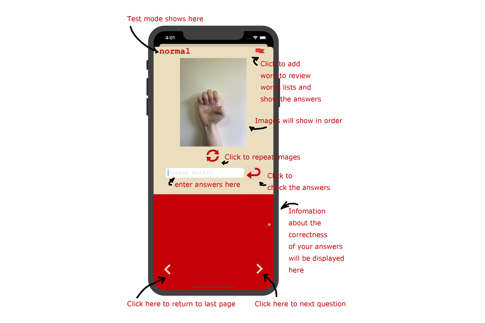
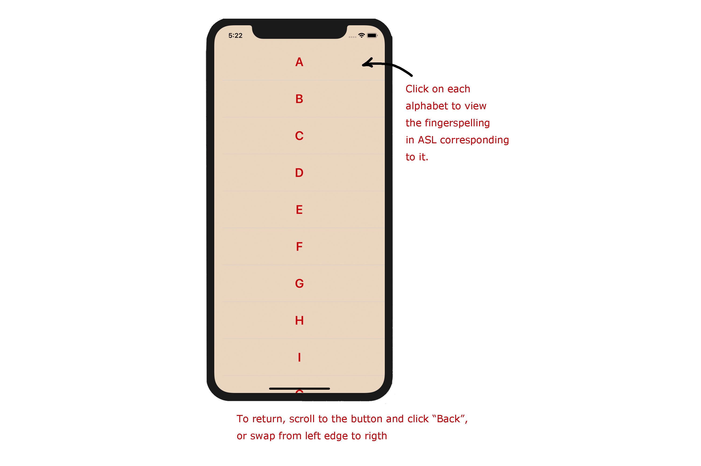
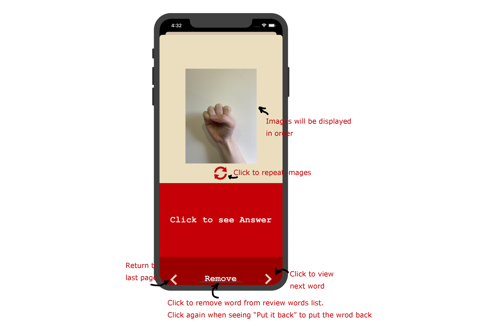

# WiSign

####Authors: 

Yuren Sun: ysun299@wisc.edu $^{[1]}$

Harry Zhao: lzhao224@wisc.edu $^{[2]}$

Siyuan Zhang: szhang577@wisc.edu $^{[1]}$

[1] College of Letters & Science, University of Wisconsin - Madison
[2] College of Engineering, University of Wisconsin - Madison

© 2019 Yuren Sun, Harry Zhao, Siyuan Zhang

## Contents

- [What is WiSign](##What is WiSign)
- [The Icon of WiSign](##The Icon of WiSign)
- [Functions of WiSign](##Functions of WiSign)
  - [Quiz](###Quiz)
  - [Study](###Study)
- [User Guide](##User Guide)
  - [Guide for Quiz](###Guide for Quiz)
  - [Guide for Study](###Guide for Study)
    - [Study A - Z](####Study A - Z)
    - [Review](####Review)
- [Future plan](##Future Plan)

##What is WiSign

There rapid growing attention to Deaf or Hard of Hearing(DHOH) people. In this way, more people are able to study and use American Sign Language(ASL) than ever before. 

There are many applications focusing on learning the ASL now. However, few of them aimed at testing how users learn fingerspelling in ASL and improve their learning based on the results of the quizzes.

With this goal in mind, we developed WiSign. This is an iOS application that helps ASL users and learners get start with ASL by learning basic 26 alphabets, know how they decode fingerspelling in ASL by taking quizzes, and familiar them with fingerspelling more through reviewing.

## The Icon of WiSign

Our icon is made of 2 symmetric "I love you" sign in ASL.  This sign combines the American fingerspelled letters I , L, and Y.

We are from University of Wisconsin - Madison. We have the tradition to make "W" to show our pride for being a badger! This is the reason why we use two sign reflected, inverted, and combined to make it into an "W" in the middle. 

## Functions of WiSign

WiSign is divided into two main functions, Quiz and Study

### Quiz
This function test how the user learns the fingerspelling in ASL. We fulfill this aim by testing how users identify different words by fingerspelling, combinations of signed alphabets, in different length-of-word ranges and send the words they inaccurately identify to review words list. 

Users can choose one of the four modes: easy, normal, hard, and evil, which contains words with length less than 3 characters, 4 - 6 characters, 7 - 8 characters, and equal or over 9 characters, separately.

Our word list is generated from dictionaries in the Github repository and can be found from https://github.com/stoneotaku/vobmaster.git. We developed a python program to filter all the words in the word lists to the length corresponding to the 4 modes.

Every word is shown to the users by images of ASL alphabet signs corresponding to characters in the words. The duration of each image is 0.5 seconds.

We check how the user learns the fingerspelling in ASL by asking them to type the words they see and check whether they identify each sign accurately. The test input is not case sensitive. If the user enters the correct answer, the app will swift to the next question automatically. Otherwise, the current question will be added to the review words list and the images will be displayed again for users. The users can also put the current question directly to the review words list and see the answer directly. Users can take as many quizzes as they want.

### Study

The study section has two parts, Study A - Z and Review.

Study A - Z  part is designed for new ASL learners. They can view all the characters in alphabet order individually.

Review part is designed for users to go over words they identified inaccurately or put into review words list during the quizzes. In this part, the images of signs are displayed the same as that in the quiz. However, users are not required to enter the words; instead, they can click the button to see answers directly. Besides, they can choose to remove the words from the review words list if they believe they master this combination of signs. After the user clicks the remove button, the button will change to the button for putting the words back if users remove them mistakenly.

 ## User Guide

### Guide for Quiz

###Guide for Study

####Study A - Z

#### Review

## Future Plan

Since this application is developed during Madhack within less than 24 hours, some functions are not fully developed. In the future, we hope to fulfill following plans：

1. The current image speed is set to 0.5 seconds, we hope to update the setting and enable users to set the different speed according to their ability with fingerspelling in ASL.
2. The current UI is only compatible with iPhone XR. We hope to improve the UI and adapt it to all the currently available devices.
3. We believe that daily practice is important than Setting daily goals for the user based on their quiz results. We want to include motivations for users to do so. To do so, we may add sections such as daily challenges, rankings, and archives. 
4. We believe it is also of great importance for users to use the actual signs in ASL in addition to identifying longer phase and sentence. Therefore, we hope to use a large number of videos to train models to recognize fingers' and palms' movements by users. In this way, we are able to test whether users can use the actual signs in ASL corresponding to the phrases or even sentences.
5. We want to help connect and enlarge the Deaf Community as well as spreading its culture. We hope to build an online cloud community within WiSign so that ASL users and learners across the world can get in touch with each other better.